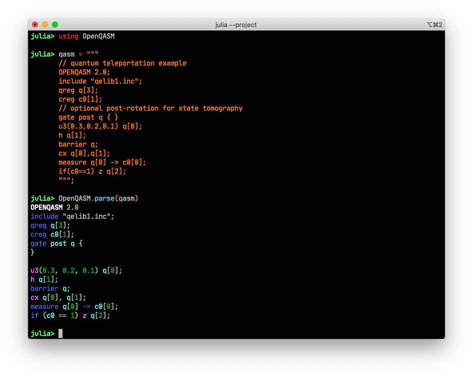

# OpenQASM

[](https://github.com/QuantumBFS/OpenQASM.jl/actions)
[](https://codecov.io/gh/QuantumBFS/OpenQASM.jl)

Tools for parsing OpenQASM.

## Installation

<p>
OpenQASM is a &nbsp;
    <a href="https://julialang.org">
        
        Julia Language
    </a>
    &nbsp; package. To install OpenQASM,
    please <a href="https://docs.julialang.org/en/v1/manual/getting-started/">open
    Julia's interactive session (known as REPL)</a> and press <kbd>]</kbd> key in the REPL to use the package mode, then type the following command
</p>

```julia
pkg> add OpenQASM
```

## Usage

This package provides a simple function `OpenQASM.parse` to parse a QASM string to
its AST according to its BNF specification described in [OpenQASM 2.0](https://github.com/Qiskit/openqasm/tree/OpenQASM2.x).




## Roadmap

- [x] support for QASM 2.0
- [ ] support for QASM 3.0

## Cite Us

If you use OpenQASM.jl in your research, please cite our paper:

```bibtex
@article{Luo2020yaojlextensible,
  doi = {10.22331/q-2020-10-11-341},
  url = {https://doi.org/10.22331/q-2020-10-11-341},
  title = {Yao.jl: {E}xtensible, {E}fficient {F}ramework for {Q}uantum {A}lgorithm {D}esign},
  author = {Luo, Xiu-Zhe and Liu, Jin-Guo and Zhang, Pan and Wang, Lei},
  journal = {{Quantum}},
  issn = {2521-327X},
  publisher = {{Verein zur F{\"{o}}rderung des Open Access Publizierens in den Quantenwissenschaften}},
  volume = {4},
  pages = {341},
  month = oct,
  year = {2020}
}
```

## License

OpenQASM is released under the MIT license.
