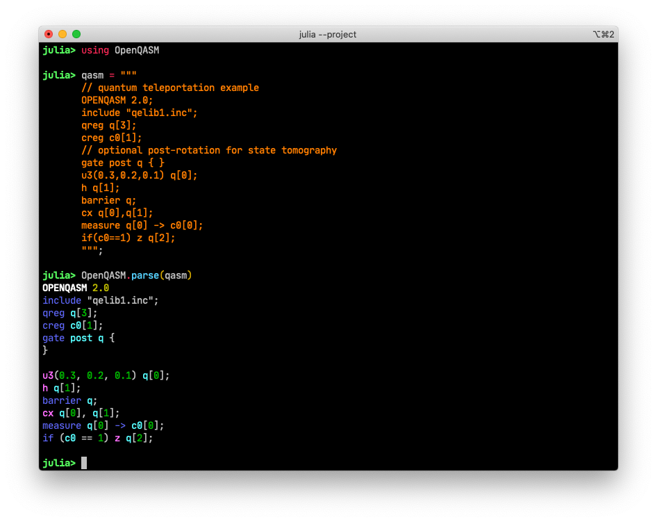

# OpenQASM

[](https://github.com/QuantumBFS/OpenQASM.jl/actions/workflows/ci.yml)
[](https://codecov.io/gh/QuantumBFS/OpenQASM.jl)

Tools for parsing OpenQASM 2.0 and 3.0.

## Installation

<p>
OpenQASM is a &nbsp;
    <a href="https://julialang.org">
        
        Julia Language
    </a>
    &nbsp; package. To install OpenQASM,
    please <a href="https://docs.julialang.org/en/v1/manual/getting-started/">open
    Julia's interactive session (known as REPL)</a> and press <kbd>]</kbd> key in the REPL to use the package mode, then type the following command
</p>

```julia
pkg> add OpenQASM
```

## Usage

This package provides a simple function `OpenQASM.parse` to parse QASM programs (both 2.0 and 3.0) to their AST representation.

### OpenQASM 2.0

Parse QASM 2.0 programs according to the [OpenQASM 2.0 specification](https://github.com/Qiskit/openqasm/tree/OpenQASM2.x):

```julia
using OpenQASM

qasm_2_0 = """
OPENQASM 2.0;
include "qelib1.inc";
qreg q[2];
creg c[2];
h q[0];
cx q[0], q[1];
measure q -> c;
"""

ast = parse(qasm_2_0)  # Auto-detects version 2.0
```



### OpenQASM 3.0

Parse QASM 3.0 programs with support for classical types, control flow, gate modifiers, and input/output parameters:

```julia
using OpenQASM

qasm_3_0 = """
OPENQASM 3.0;
include "stdgates.inc";

input float[64] theta;
qubit[2] q;
bit[2] c;

reset q[0];
reset q[1];

ry(theta) q[0];
ctrl @ x q[0], q[1];

measure q -> c;

if (c[0] == 1) {
    x q[0];
}

output bit[2] c;
"""

ast = parse(qasm_3_0)  # Auto-detects version 3.0
```

### Supported OpenQASM 3.0 Features

This package currently supports the following OpenQASM 3.0 features:

- **Classical Types**: `int`, `uint`, `float`, `bit`, `angle` with optional bit widths
  ```julia
  int[32] x = 5;
  float[64] y = 3.14;
  const angle[20] theta = pi/4;
  ```

- **Control Flow**: `if-else`, `while`, `for` loops, `break`, `continue`
  ```julia
  if (c == 1) { x q; } else { h q; }
  while (i < 10) { i = i + 1; }
  for int i in [0:10] { ... }
  for int i in {1, 5, 10} { ... }
  ```

- **Gate Modifiers**: `inv`, `ctrl`, `negctrl`, `pow`
  ```julia
  inv @ h q[0];
  ctrl @ x q[0], q[1];
  pow(2) @ s q[0];
  ```

- **Input/Output Parameters**: Parameterized circuits
  ```julia
  input float[64] theta;
  output bit[2] c;
  ```

- **Qubit Declarations**: New syntax alongside legacy `qreg`/`creg`
  ```julia
  qubit[2] q;     // New QASM 3.0 syntax
  qreg q[2];      // Legacy syntax (still supported)
  ```

### API Reference

- `parse(src::String; version=:auto)` - Parse QASM program with auto version detection
- `parse_v2(src::String)` - Parse QASM 2.0 program explicitly
- `parse_v3(src::String)` - Parse QASM 3.0 program explicitly
- `detect_version(src::String)` - Detect OpenQASM version from source code
- `parse_gate(src::String)` - Parse a QASM 2.0 gate definition

### Breaking Changes from OpenQASM 2.0 to 3.0

Important differences to be aware of when migrating from QASM 2.0 to 3.0:

1. **Qubit Initialization**: In QASM 3.0, qubits are **NOT** automatically initialized to |0⟩. You must explicitly use `reset`:
   ```julia
   // QASM 2.0: qreg q[2]; automatically initializes to |00⟩
   // QASM 3.0: qubit[2] q; does NOT initialize
   qubit[2] q;
   reset q;  // Required to ensure |0⟩ state
   ```

2. **New Syntax**: Prefer `qubit[n]` over `qreg`, and `bit[n]` over `creg` in QASM 3.0 (though legacy syntax is still supported)

3. **Enhanced Expressions**: QASM 3.0 supports logical operators (`&&`, `||`), comparison operators (`==`, `!=`, `<`, `>`, `<=`, `>=`), and power operator (`**`)

## Roadmap

- [x] support for QASM 2.0
- [x] support for QASM 3.0 (basic features)
  - [x] Classical types (int, uint, float, bit, angle)
  - [x] Control flow (if-else, while, for loops)
  - [x] Gate modifiers (inv, ctrl, pow)
  - [x] Input/output parameters
  - [ ] Arrays (multi-dimensional)
  - [ ] Subroutines (def keyword)
  - [ ] Pulse-level calibration (defcal)
  - [ ] Timing control (delay, box, stretch)

## Cite Us

If you use OpenQASM.jl in your research, please cite our paper:

```bibtex
@article{Luo2020yaojlextensible,
  doi = {10.22331/q-2020-10-11-341},
  url = {https://doi.org/10.22331/q-2020-10-11-341},
  title = {Yao.jl: {E}xtensible, {E}fficient {F}ramework for {Q}uantum {A}lgorithm {D}esign},
  author = {Luo, Xiu-Zhe and Liu, Jin-Guo and Zhang, Pan and Wang, Lei},
  journal = {{Quantum}},
  issn = {2521-327X},
  publisher = {{Verein zur F{\"{o}}rderung des Open Access Publizierens in den Quantenwissenschaften}},
  volume = {4},
  pages = {341},
  month = oct,
  year = {2020}
}
```

## License

OpenQASM is released under the MIT license.
